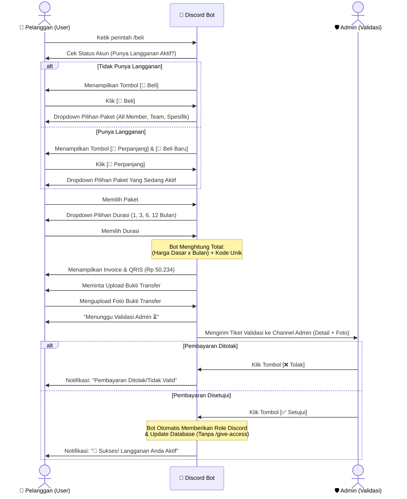

# Proposal Workflow: Sistem Otomatisasi Pembelian & Perpanjangan Langganan via Discord

Dokumen ini menjelaskan alur interaksi (User Journey) dari sisi Pelanggan dan sisi Admin terkait fitur baru pembelian otomatis melalui perintah `/beli`.

## 1. Flowchart Interaksi

Berikut adalah diagram alur yang menggambarkan keseluruhan proses dari awal hingga akses diberikan secara otomatis.

## 2. Detail Alur (User Journey)

### Tahap 1: Inisiasi (`/beli`)
Pengguna mengetikkan perintah `/beli` di *channel* yang telah ditentukan (misalnya `#loket-pembelian`). Bot akan merespons secara *private* (hanya bisa dilihat oleh pengguna tersebut) dan mengecek *database*:
- **Skenario A (User Baru/Kosong):** Muncul tombol `[🛒 Beli]`.
- **Skenario B (User Aktif):** Muncul daftar paket yang sedang ia miliki, disertai tombol `[🔄 Perpanjang]` dan `[🛒 Beli Baru]`.

### Tahap 2: Pemilihan Paket & Durasi
- **Dropdown Paket:** Pengguna memilih jenis paket (All Member, Team Love, Spesifik, dll).
- **Dropdown Durasi:** Setelah memilih paket, muncul *dropdown* kedua untuk memilih durasi berlangganan (1 Bulan, 3 Bulan, 6 Bulan, dst).

### Tahap 3: Pembuatan Invoice & QRIS
Bot melakukan kalkulasi harga secara cerdas:
- `Harga Total = (Harga Dasar Paket × Jumlah Bulan) + 3 Angka Random`
- **Contoh:** Paket All Member (Rp 50.000). Angka random: `234`. Total dibayar: **Rp 50.234**.
- Bot akan menampilkan gambar QRIS Statis beserta instruksi pembayaran dengan nominal persis `Rp 50.234`.

### Tahap 4: Upload Bukti Pembayaran
Bot meminta pengguna mengunggah (upload) foto bukti transfer di *channel* tersebut. Bot akan mendeteksi gambar yang dikirimkan oleh pengguna tersebut secara otomatis. Setelah gambar terdeteksi, bot akan menginformasikan bahwa tiket sedang diproses.

---

## 3. Detail Alur (Admin Journey)

### Tahap 5: Validasi di Channel Khusus Admin
Bot akan mengirimkan sebuah "Tiket Validasi" ke *channel* tertutup yang hanya bisa dilihat oleh Admin (misal `#validasi-pembelian`). 

Tiket ini berisi:
- **Username:** `@PelangganA`
- **Pembelian:** All Member (3 Bulan)
- **Total Tagihan:** Rp 150.234
- **Lampiran:** (Foto bukti transfer yang di-*upload* pengguna)
- **Aksi:** Tombol `[✅ Setujui Pembayaran]` dan `[❌ Tolak]`

### Tahap 6: Eksekusi Otomatis (Auto-Fulfillment)
- Jika Admin mengklik **Setujui**, bot akan mengambil alih pekerjaan berat:
  1. Otomatis memasukkan *Role* (Akses Discord) ke pengguna tersebut.
  2. Otomatis memperbarui tabel `discord_subscriptions` di *database* Supabase.
  3. Mengirimkan pesan sukses ke pengguna dan ucapan selamat datang di `#info-langganan`.
*(Admin tidak perlu lagi capek-capek mengetik `/give-access` secara manual).*

---

## Data yang Dibutuhkan untuk Operasional
Agar sistem ini bisa langsung berjalan, Manajemen perlu menyiapkan dua data berikut:
1. **Daftar Harga Resmi:** Harga dasar per bulan untuk masing-masing paket (All Member, Team, Spesifik Member).
2. **Gambar QRIS Resmi:** Tautan/Link gambar barcode QRIS yang akan ditampilkan kepada pembeli.
